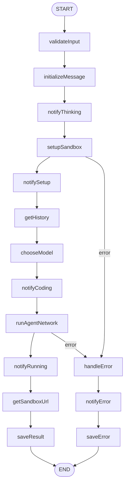
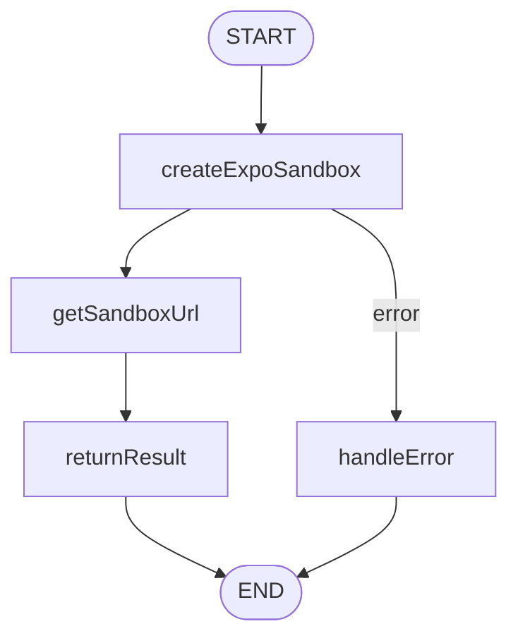

# Phase 2 — LangGraph Architecture Design

## Overview

Migration from Inngest + `@inngest/agent-kit` to **LangGraph** with **Code Interpreter** pattern for background job orchestration.

---

## Core Architecture Principles

### 1. StateGraph Pattern

- Each Inngest function becomes a **StateGraph**
- Nodes = discrete operations (sync or async)
- Edges = conditional routing between operations
- State = shared context across all nodes

### 2. Code Interpreter Node

All E2B sandbox operations wrapped in a dedicated node:

```typescript
// packages/agents/src/nodes/code-interpreter.ts
interface CodeInterpreterState {
  sandboxId: string;
  command?: string;
  files?: Array<{ path: string; content: string }>;
  result?: unknown;
  error?: string;
}
```

### 3. Persistence Layer

- **Primary**: Existing Drizzle ORM + PostgreSQL
- **Checkpointer**: LangGraph PostgresSaver (optional)
- **State snapshots**: Serialize to JSONB in `message.metadata`

---

## State Schemas (Zod)

### Base State Schema

```typescript
// packages/validators/src/agent-states.ts
export const BaseAgentStateSchema = z.object({
  // Core identifiers
  projectId: z.string(),
  userId: z.string(),
  conversationId: z.string().optional(),

  // Execution state
  step: z.string().default("init"),
  attempt: z.number().default(0),

  // Content
  messages: z
    .array(
      z.object({
        role: z.enum(["user", "assistant", "system", "tool"]),
        content: z.string(),
        tool_calls: z.array(z.any()).optional(),
      }),
    )
    .default([]),

  // Sandbox
  sandboxId: z.string().optional(),
  sandboxUrl: z.string().optional(),
  files: z.record(z.string()).default({}),

  // Agent results
  summary: z.string().optional(),
  error: z.string().optional(),
  errorType: z
    .enum(["AUTH", "NETWORK", "RUNTIME", "VALIDATION", "UNKNOWN"])
    .optional(),

  // Metadata
  startedAt: z.string().datetime().optional(),
  completedAt: z.string().datetime().optional(),
  model: z.string().optional(),
});

export type BaseAgentState = z.infer<typeof BaseAgentStateSchema>;
```

### Code Agent State (Extended)

```typescript
export const CodeAgentStateSchema = BaseAgentStateSchema.extend({
  // Code-specific
  prompt: z.string(),
  previousMessages: z.array(z.any()).default([]),
  fragmentId: z.string().optional(),
  messageId: z.string().optional(),

  // Execution tracking
  terminalOutputs: z
    .array(
      z.object({
        command: z.string(),
        stdout: z.string(),
        stderr: z.string(),
        timestamp: z.string(),
      }),
    )
    .default([]),

  // File operations
  fileOperations: z
    .array(
      z.object({
        type: z.enum(["create", "update", "read"]),
        path: z.string(),
        content: z.string().optional(),
        timestamp: z.string(),
      }),
    )
    .default([]),

  // Streaming
  streamStatus: z
    .enum([
      "idle",
      "thinking",
      "setup",
      "coding",
      "running",
      "complete",
      "error",
    ])
    .default("idle"),
});

export type CodeAgentState = z.infer<typeof CodeAgentStateSchema>;
```

---

## Graph Structure

### 1. Code Agent Graph (Main)



**Node Breakdown:**

| Node                | Purpose                  | Async | DB  | E2B   | Pusher |
| ------------------- | ------------------------ | ----- | --- | ----- | ------ |
| `validateInput`     | Validate state schema    | No    | No  | No    | No     |
| `initializeMessage` | Create pending message   | Yes   | Yes | No    | No     |
| `notifyThinking`    | Stream "thinking" status | Yes   | No  | No    | Yes    |
| `setupSandbox`      | Prepare E2B container    | Yes   | No  | Yes   | No     |
| `notifySetup`       | Stream "setup" status    | Yes   | No  | No    | Yes    |
| `getHistory`        | Fetch previous messages  | Yes   | Yes | No    | No     |
| `chooseModel`       | Select LLM provider      | No    | No  | No    | No     |
| `notifyCoding`      | Stream "coding" status   | Yes   | No  | No    | Yes    |
| `runAgentNetwork`   | Execute agent with tools | Yes   | No  | Yes\* | No     |
| `notifyRunning`     | Stream "running" status  | Yes   | No  | No    | Yes    |
| `getSandboxUrl`     | Get sandbox public URL   | Yes   | No  | Yes   | No     |
| `saveResult`        | Save message + fragment  | Yes   | Yes | No    | No     |
| `handleError`       | Classify error           | No    | No  | No    | No     |
| `notifyError`       | Stream error to UI       | Yes   | No  | No    | Yes    |
| `saveError`         | Save error message       | Yes   | Yes | No    | No     |

\*Agent network uses Code Interpreter node for E2B calls

### 2. Hello World Graph (Simple)



---

## Node Implementation Patterns

### 1. Database Node Pattern

```typescript
// packages/agents/src/nodes/db-nodes.ts
import { db } from "@acme/db/client";
import { fragment, message } from "@acme/db/schema";

export const initializeMessageNode = async (state: CodeAgentState) => {
  const [newMessage] = await db
    .insert(message)
    .values({
      id: generateUUID(),
      projectId: state.projectId,
      role: "ASSISTANT",
      type: "RESULT",
      content: "",
      state: "pending",
    })
    .returning();

  return {
    messages: [...state.messages, { role: "assistant", content: "" }],
    messageId: newMessage.id,
  };
};
```

### 2. Pusher Notification Node Pattern

```typescript
// packages/agents/src/nodes/stream-nodes.ts
import { pusher } from "@acme/pusher";

export const notifyStatusNode =
  (status: string) => async (state: CodeAgentState) => {
    await pusher.trigger(`private-project-${state.projectId}`, "agent-status", {
      status,
      step: state.step,
      timestamp: new Date().toISOString(),
    });

    return { streamStatus: status };
  };
```

### 3. Code Interpreter Node Pattern

```typescript
// packages/agents/src/nodes/code-interpreter.ts
import { getSandbox } from "@acme/e2b/utils";

export const codeInterpreterNode = async (state: CodeAgentState) => {
  if (!state.sandboxId) {
    throw new Error("No sandbox ID in state");
  }

  const sandbox = await getSandbox(state.sandboxId);

  // Execute command if provided
  if (state.command) {
    const result = await sandbox.commands.run(state.command);
    return { result: result.stdout };
  }

  // Write files if provided
  if (state.files) {
    const updatedFiles = { ...state.files };
    for (const file of state.files) {
      await sandbox.files.write(file.path, file.content);
      updatedFiles[file.path] = file.content;
    }
    return { files: updatedFiles };
  }

  return {};
};
```

### 4. Agent Network Node Pattern

```typescript
// packages/agents/src/nodes/agent-network.ts
import { createReactAgent } from "@langchain/agents";
import { ChatAnthropic, ChatOpenAI } from "@langchain/ai";

export const runAgentNetworkNode = async (state: CodeAgentState) => {
  const model = getModel(state.model); // OpenAI/Anthropic/Gemini

  const tools = [
    createTerminalTool(state.sandboxId!),
    createFileTool(state.sandboxId!),
    createReadFileTool(state.sandboxId!),
  ];

  const agent = createReactAgent({
    llm: model,
    tools,
    systemMessage: CODE_AGENT_PROMPT,
  });

  const result = await agent.invoke({
    messages: [
      ...state.previousMessages,
      { role: "user", content: state.prompt },
    ],
  });

  // Extract summary from final message
  const lastMessage = result.messages[result.messages.length - 1];
  const summary = extractSummary(lastMessage.content);

  return {
    messages: [...state.messages, ...result.messages],
    summary,
    terminalOutputs: extractTerminalLogs(result),
    fileOperations: extractFileOperations(result),
  };
};
```

---

## Tool Migration (Inngest → LangChain)

### Current Inngest Tools

```typescript
// Before (Inngest/agent-kit)
export const terminalTool = createTool({
  name: "terminal",
  description: "Run terminal commands",
  parameters: z.object({ command: z.string() }),
  handler: async ({ command }, { step, network }) => {
    return await step?.run("terminal", async () => {
      // ... implementation
    });
  },
});
```

### LangChain Tool Pattern

```typescript
// After (LangChain)
import { tool } from "@langchain/core/tools";
import { z } from "zod";

export const createTerminalTool = (sandboxId: string) =>
  tool(
    async ({ command }: { command: string }) => {
      const sandbox = await getSandbox(sandboxId);
      const result = await sandbox.commands.run(command);
      return result.stdout;
    },
    {
      name: "terminal",
      description: "Run terminal commands in the sandbox",
      schema: z.object({ command: z.string() }),
    },
  );
```

---

## Package Structure Changes

### Current

```
packages/
├── agents/
│   ├── src/
│   │   ├── agents/          # Inngest agent definitions
│   │   ├── code-agent.ts    # createAgent from @inngest/agent-kit
│   │   ├── coding-agent-network.ts
│   │   └── tools/           # Inngest tools
├── jobs/
│   └── src/functions/       # Inngest functions
```

### After Migration

```
packages/
├── agents/
│   ├── src/
│   │   ├── graphs/
│   │   │   ├── code-agent-graph.ts      # Main StateGraph
│   │   │   ├── hello-world-graph.ts     # Simple test graph
│   │   │   └── index.ts
│   │   ├── nodes/
│   │   │   ├── db-nodes.ts              # Database operations
│   │   │   ├── stream-nodes.ts          # Pusher notifications
│   │   │   ├── code-interpreter.ts      # E2B sandbox wrapper
│   │   │   ├── agent-network.ts         # Agent execution
│   │   │   └── index.ts
│   │   ├── tools/
│   │   │   ├── terminal-tool.ts         # LangChain tools
│   │   │   ├── file-tool.ts
│   │   │   └── index.ts
│   │   ├── prompts/
│   │   │   └── code-agent-prompt.ts     # Existing (unchanged)
│   │   ├── models/
│   │   │   └── model-factory.ts         # Model selection
│   │   └── index.ts
├── jobs/                    # DEPRECATED (keep until tested)
│   └── src/functions/       # Original Inngest functions
├── validators/
│   └── src/
│       └── agent-states.ts  # Zod state schemas
```

---

## tRPC Integration

### Current

```typescript
// packages/api/src/router/code-agent.ts
await inngest.send({
  name: "code-agent/run",
  data: { projectId, userPrompt, conversationId, model },
});
```

### After

```typescript
// packages/api/src/router/code-agent.ts
import { codeAgentGraph } from "@acme/agents";

const result = await codeAgentGraph.invoke({
  projectId,
  prompt: userPrompt,
  conversationId,
  model,
});
```

Or with streaming:

```typescript
const stream = await codeAgentGraph.stream({
  projectId,
  prompt: userPrompt,
  // ...
});

for await (const state of stream) {
  yield state;
}
```

---

## Error Handling Strategy

### Node-Level Error Handling

```typescript
const safeNode = (nodeFn: NodeFunction) => async (state: AgentState) => {
  try {
    return await nodeFn(state);
  } catch (error) {
    return {
      error: error instanceof Error ? error.message : "Unknown error",
      errorType: classifyError(error),
      step: `${state.step}_error`,
    };
  }
};

// Usage
graph.addNode("setupSandbox", safeNode(setupSandboxNode));
```

### Graph-Level Error Routing

```typescript
// Conditional edge for error handling
graph.addConditionalEdges("setupSandbox", (state) => {
  if (state.error) return "handleError";
  return "notifySetup";
});
```

---

## State Persistence

### Option 1: LangGraph PostgresSaver (Recommended)

```typescript
import { PostgresSaver } from "@langchain/langgraph-checkpoint-postgres";

const checkpointer = new PostgresSaver({
  connectionString: process.env.DATABASE_URL!,
});

const graph = codeAgentGraph.compile({ checkpointer });
```

### Option 2: Custom Drizzle Checkpointer

```typescript
// If we need more control
import { BaseCheckpointSaver } from "@langchain/langgraph";

class DrizzleCheckpointSaver extends BaseCheckpointSaver {
  async get(threadId: string) {
    const result = await db.query.langgraphCheckpoint.findFirst({
      where: eq(langgraphCheckpoint.threadId, threadId),
    });
    return result?.state;
  }

  async put(threadId: string, state: unknown) {
    await db.insert(langgraphCheckpoint).values({
      threadId,
      state,
      updatedAt: new Date(),
    });
  }
}
```

---

## Streaming Strategy

### Current (Pusher)

Inngest functions call Pusher at specific steps to stream status updates.

### After (Pusher + LangGraph Events)

```typescript
// LangGraph events can be streamed
eventStream.on("node:start", ({ node }) => {
  pusher.trigger(channel, "agent-status", { status: node });
});

eventStream.on("node:end", ({ node, output }) => {
  if (output.streamStatus) {
    pusher.trigger(channel, "agent-status", {
      status: output.streamStatus,
    });
  }
});
```

---

## Migration Sequence

### Phase 2.1 — Setup Infrastructure

1. Install LangGraph dependencies
2. Create state schemas in `packages/validators`
3. Setup PostgresSaver checkpointer
4. Create base graph utilities

### Phase 2.2 — Node Implementation

1. Implement `codeInterpreterNode` (E2B wrapper)
2. Implement database nodes
3. Implement streaming nodes
4. Implement agent network node
5. Implement error handling nodes

### Phase 2.3 — Graph Assembly

1. Build `helloWorldGraph` (simplest, for testing)
2. Build `codeAgentGraph` (main graph)
3. Add conditional edges and error routing
4. Add state persistence

### Phase 2.4 — Integration

1. Create tRPC routes that call graphs directly
2. Maintain Inngest routes as fallback
3. Add feature flag for gradual rollout

---

## Dependencies to Add

```json
// packages/agents/package.json
{
  "dependencies": {
    "@langchain/core": "^0.3.x",
    "@langchain/ai": "^0.3.x",
    "@langchain/agents": "^0.3.x",
    "@langchain/langgraph": "^0.2.x",
    "@langchain/langgraph-checkpoint-postgres": "^0.1.x",
    "zod": "^3.x" // Already present
  }
}
```

---

## Testing Strategy

### Unit Tests

```typescript
// Test individual nodes
expect(await initializeMessageNode(mockState)).toHaveProperty("messageId");
```

### Integration Tests

```typescript
// Test full graph execution
const result = await helloWorldGraph.invoke({
  projectId: "test-project",
});
expect(result.sandboxUrl).toBeDefined();
```

### E2E Tests

- Use Playwright for UI streaming tests
- Verify Pusher events arrive in correct order
- Verify database state consistency

---

## Performance Considerations

1. **State Size**: Store large data (file contents) separately, reference by ID
2. **Node Granularity**: Keep nodes small and focused for better observability
3. **Async Boundaries**: Mark E2B and DB operations as async nodes
4. **Timeouts**: Add timeout configuration per node
5. **Retry Logic**: Use LangGraph's built-in retry mechanisms

---

## Rollback Plan

1. **Feature Flags**: Keep Inngest functions active behind flags
2. **Dual Write**: Run both systems in parallel during transition
3. **Data Compatibility**: Ensure message/fragment schema remains compatible
4. **Monitoring**: Add alerts for graph execution failures

---

## Next Steps

Ready to proceed to **Phase 3 — Execution**:

1. Install dependencies
2. Create state schemas
3. Implement hello-world graph (simplest first)
4. Implement code-agent graph
5. Update tRPC routes
6. Remove Inngest (after testing)
